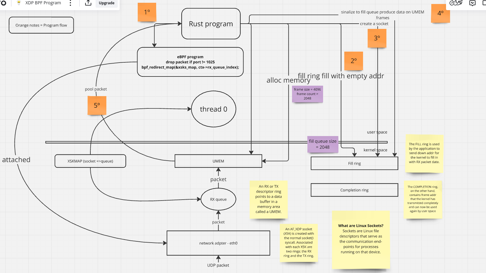
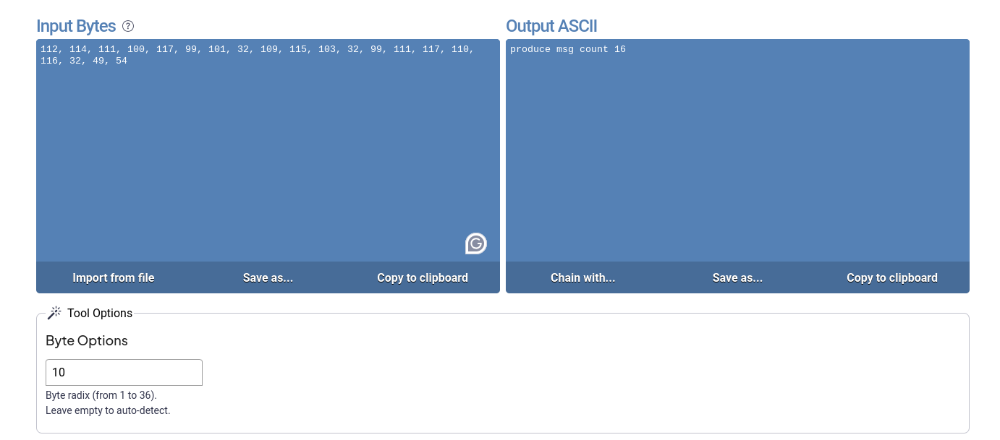

# XDP and BPF study case

- [XDP and BPF study case](#xdp-and-bpf-study-case)
   * [Introduction](#introduction)
   * [AF_XDP redirect UDP packages example using Rust (using docker)](#af_xdp-redirect-udp-packages-example-using-rust-using-docker)
      + [How to run this example](#how-to-run-this-example)
         - [Start docker compose with](#start-docker-compose-with)
         - [Checking second container logs, we will see rust program pooling messages from RX queue:](#checking-second-container-logs-we-will-see-rust-program-pooling-messages-from-rx-queue)
         - [Decoding payload bytes we will see UDP producer message being received from rust program.](#decoding-payload-bytes-we-will-see-udp-producer-message-being-received-from-rust-program)
         - [Finally, let's check bpf program logs. We will see packets being dropped:](#finally-lets-check-bpf-program-logs-we-will-see-packets-being-dropped)
   * [Drop only ICMP packets using XDP and eBPF on docker container](#drop-only-icmp-packets-using-xdp-and-ebpf-on-docker-container)
      + [Build and run an ubuntu docker container:](#build-and-run-an-ubuntu-docker-container)
      + [Get shell on docker container:](#get-shell-on-docker-container)
      + [Check if eth0 haven't XDP drop installed](#check-if-eth0-havent-xdp-drop-installed)
      + [Get eth0 IP and ping the IP](#get-eth0-ip-and-ping-the-ip)
      + [Install xdp drop on eth0](#install-xdp-drop-on-eth0)
      + [Check if BPF program has attach to eth0](#check-if-bpf-program-has-attach-to-eth0)
      + [Now, ping command must fail](#now-ping-command-must-fail)
      + [Unistalling BPF program and check ping again:](#unistalling-bpf-program-and-check-ping-again)
   * [Useful commands](#useful-commands)
   * [References](#references)

## Introduction

This project was created to practice and study AF_XDP and eBPF approach. To understand more about these topics access these links:

  * [BFP and XDP Reference Guide](https://docs.cilium.io/en/v1.6/bpf/#bpf-and-xdp-reference-guide)
  * [kernel AF_XDP docs](https://docs.kernel.org/networking/af_xdp.html)
  * More links on [Reference section]()

## AF_XDP redirect UDP packages example using Rust (using docker)

In this example we will create a Rust program to attach a BPF program (using libbpf-rs crate) to eth0 interface to redirect UDP packages
to XDP sockets (the RX ring). After attach BPF program, it will pool messages from XDP socket
using [xsk-rs](https://github.com/DouglasGray/xsk-rs) (A Rust interface for Linux AF_XDP sockets using libxdp).

See diagram below to check more details:



### How to run this example

#### Start docker compose with

    cd udpredirect
    make run

The command make run will start two containers, one with a simple python script to send UDP packets to second container, this second container will start a rust program that will attach a BPF program to just redirect UDP packets coming from source port 1025

udpproducer container logs:

```
docker-compose run --rm udpproducer                                                                                                    
Creating network "udpredirect_default" with the default driver                                                                         
Creating udpredirect_udpredirect_1 ... done                                                                                            
Creating udpredirect_udpproducer_run ... done                                                                                          
12/12/2024 09:03:32 AM produce msg count 0                                                                                             
12/12/2024 09:03:33 AM produce msg count 1                                                                                             
12/12/2024 09:03:34 AM produce msg count 2                                                                                             
12/12/2024 09:03:35 AM produce msg count 3
```

#### Checking second container logs, we will see rust program pooling messages from RX queue:

```
[2024-12-12T12:03:48Z INFO  udpredirect::xdpqueue] receiver rx queue consumed 1 frames
dest port: 1025
payload: [112, 114, 111, 100, 117, 99, 101, 32, 109, 115, 103, 32, 99, 111, 117, 110, 116, 32, 49, 54]
[2024-12-12T12:03:48Z INFO  udpredirect::xdpqueue] received this packet Data { contents: [2, 66, 172, 20, 0, 2, 2, 66, 172, 20, 0, 3, 8, 0, 69, 0, 0, 48, 42, 43, 64, 0, 64, 17, 184, 100, 172, 20, 0, 3, 172, 20, 0, 2, 187, 138, 4, 1, 0, 28, 88, 91, 112, 114, 111, 100, 117, 99, 101, 32, 109, 115, 103, 32, 99, 111, 117, 110, 116, 32, 49, 54] }
[2024-12-12T12:03:48Z INFO  udpredirect::xdpqueue] submitted 1 frames to receiver fill queue
```
#### Decoding payload bytes we will see UDP producer message being received from rust program.



#### Finally, let's check bpf program logs. We will see packets being dropped:

```
    avahi-daemon-981     [004] ..s2.  4311.823160: bpf_trace_printk: by passing udp dest port 59668
    avahi-daemon-981     [002] ..s2.  4327.115953: bpf_trace_printk: by passing udp dest port 59668

```

## Drop only ICMP packets using XDP and eBPF on docker container

This example we will build a docker image and load a BPF program that will drop ICMP packets. This docker image has LLVM and clang compiler to build  BPF program and iproute2 to load the program to kernel. 

### Build and run an ubuntu docker container:

    make run

### Get shell on docker container:

    docker ps
    docker exec -ti CONTAINER_ID bash

### Check if eth0 haven't XDP drop installed

```
root@b057d1219412:/# ip link show dev eth0
53: eth0@if54: <BROADCAST,MULTICAST,UP,LOWER_UP> mtu 1500 qdisc noqueue state UP mode DEFAULT group default 
    link/ether 02:42:ac:11:00:02 brd ff:ff:ff:ff:ff:ff link-netnsid 0
root@b057d1219412:/#
```

### Get eth0 IP and ping the IP

```
ip route |grep default | cut -d' ' -f3
root@b057d1219412:/# ping -c 3 172.17.0.1
PING 172.17.0.1 (172.17.0.1) 56(84) bytes of data.
64 bytes from 172.17.0.1: icmp_seq=1 ttl=64 time=0.175 ms
64 bytes from 172.17.0.1: icmp_seq=2 ttl=64 time=0.110 ms
64 bytes from 172.17.0.1: icmp_seq=3 ttl=64 time=0.141 ms

--- 172.17.0.1 ping statistics ---
```

### Install xdp drop on eth0

    root@842c94a57112:/# ip link set dev eth0 xdp obj /xdp-udp.o sec drop_icmp

### Check if BPF program has attach to eth0

```
root@842c94a57112:/# ip link show dev eth0
66: eth0@if67: <BROADCAST,MULTICAST,UP,LOWER_UP> mtu 1500 xdp qdisc noqueue state UP mode DEFAULT group default 
    link/ether 02:42:ac:11:00:02 brd ff:ff:ff:ff:ff:ff link-netnsid 0
    prog/xdp id 197 tag 2e4d04fb1c2c6dc6 jited 
root@842c94a57112:/# 

```

### Now, ping command must fail

```
root@842c94a57112:/# ping -c3 172.17.0.1
PING 172.17.0.1 (172.17.0.1) 56(84) bytes of data.

--- 172.17.0.1 ping statistics ---
3 packets transmitted, 0 received, 100% packet loss, time 2061ms

root@842c94a57112:/# 

```
### Unistalling BPF program and check ping again:

```
ip link set dev eth0 xdp off
root@842c94a57112:/# ping -c 3 172.17.0.1
PING 172.17.0.1 (172.17.0.1) 56(84) bytes of data.
64 bytes from 172.17.0.1: icmp_seq=1 ttl=64 time=0.091 ms
64 bytes from 172.17.0.1: icmp_seq=2 ttl=64 time=0.189 ms
64 bytes from 172.17.0.1: icmp_seq=3 ttl=64 time=0.127 ms

--- 172.17.0.1 ping statistics ---
3 packets transmitted, 3 received, 0% packet loss, time 2036ms
rtt min/avg/max/mdev = 0.091/0.135/0.189/0.040 ms
root@842c94a57112:/# 

```

## Useful commands

Inspect all UDP packages

    sudo tcpdump -i lo -n udp port 2399 -v -X

Cat BPF trace/prints on host or mount debugFS on docker container

    sudo cat  /sys/kernel/debug/tracing/trace_pipe


## References

https://gitlab.com/mwiget/xdp-drop-test/-/tree/master?ref_type=heads
https://github.com/xdp-project/xdp-tutorial/blob/master/tracing03-xdp-debug-print/README.org
https://docs.kernel.org/bpf/map_xskmap.html
https://github.com/DouglasGray/xsk-rs
https://github.com/libbpf/libbpf-rs/tree/master/examples
https://gist.github.com/fntlnz/f6638d59e0e39f0993219684d9bf57d3
https://docs.kernel.org/networking/af_xdp.html
https://hemslo.io/run-ebpf-programs-in-docker-using-docker-bpf/
